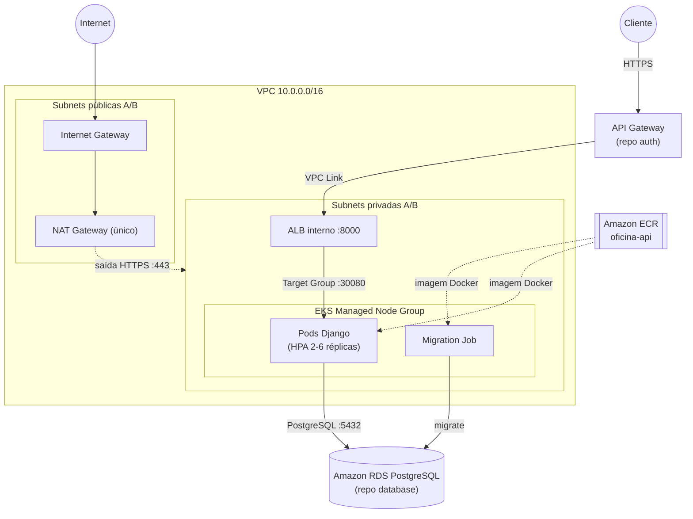

# Tech Challenge Oficina — Infraestrutura Kubernetes

Infraestrutura como código (Terraform) e manifests Kubernetes da **Fase 3 do Tech Challenge FIAP** (Grupo 80): provisiona a VPC, o cluster Amazon EKS, o ALB interno e o Amazon ECR, e mantém os manifests que executam, escalam e atualizam a API da oficina.

Este repositório não contém a aplicação (repo `tech-challenge-oficina`), o banco de dados (repo `tech-challenge-oficina-database`) nem a autenticação (repo `tech-challenge-oficina-auth`) — apenas a infraestrutura onde a API roda e por onde ela é alcançada, via API Gateway do repositório `auth` chegando ao ALB interno por VPC Link.

## Tecnologias

| Camada | Tecnologia / Ferramenta | Detalhe |
| --- | --- | --- |
| IaC | Terraform `>= 1.5.0` | Provider `hashicorp/aws` (lock: `6.61.0`); backend S3 + lock em DynamoDB |
| Cloud | AWS | VPC, Amazon EKS, ALB, Amazon ECR, NAT Gateway, Internet Gateway, IAM (roles do AWS Academy Lab) |
| Orquestração | Kubernetes | Amazon EKS `v1.35`, `kubectl` |
| Observabilidade | New Relic | Agente APM na aplicação (ConfigMap + Secret `newrelic-license`); sem agente de infraestrutura no cluster |
| CI/CD | GitHub Actions | `ci.yml` (lint e validação) e `cd.yml` (`terraform plan`/`apply` por ambiente) |

## Arquitetura



O ALB é interno (sem exposição direta à internet) e o NAT Gateway é único por restrição de custo do AWS Academy — detalhes em [docs/architecture.md](docs/architecture.md) e nos [ADRs](docs/adrs/).

## Estrutura do repositório

```text
tech-challenge-oficina-k8s/
├── terraform/            # VPC, EKS, ALB, ECR, security groups, outputs
│   └── environments/      # tfvars por ambiente (homologacao, producao)
├── k8s/                  # namespace, configmap, deployment, service, hpa, migration-job, secrets de exemplo
├── docs/
│   ├── architecture.md
│   ├── kubernetes.md
│   ├── rede-e-seguranca.md
│   ├── operacao.md
│   └── adrs/
├── .github/workflows/    # ci.yml, cd.yml
├── CONTRIBUTING.md
└── README.md
```

## Passos para execução e deploy

### Pré-requisitos

* Terraform `>= 1.5.0`
* AWS CLI configurada com credenciais válidas (AWS Academy Lab)
* `kubectl`
* Docker (para builds locais da imagem, se necessário)

### Provisionar a infraestrutura

```bash
cd terraform
terraform init
terraform plan  -var-file=environments/homologacao/terraform.tfvars \
  -var="eks_cluster_role_arn=<ARN_LAB_EKS_CLUSTER_ROLE>" \
  -var="eks_node_role_arn=<ARN_LAB_EKS_NODE_ROLE>"
terraform apply -var-file=environments/homologacao/terraform.tfvars \
  -var="eks_cluster_role_arn=<ARN_LAB_EKS_CLUSTER_ROLE>" \
  -var="eks_node_role_arn=<ARN_LAB_EKS_NODE_ROLE>"
```

`eks_cluster_role_arn` e `eks_node_role_arn` são obrigatórias (`aws_region` tem default `us-east-1`). Detalhes de variáveis, backend e outputs em [docs/operacao.md](docs/operacao.md).

### Configurar o kubectl

```bash
aws eks update-kubeconfig --region us-east-1 --name oficina-eks
kubectl get nodes
```

### Aplicar os manifests (nesta ordem)

```bash
cd k8s
kubectl apply -f namespace.yaml
kubectl apply -f configmap.yaml
kubectl apply -f secret.example.yaml        # copiar, preencher e renomear antes
kubectl apply -f oficina-auth.example.yaml  # idem
kubectl apply -f deployment.yaml
kubectl apply -f service.yaml
kubectl apply -f hpa.yaml
kubectl apply -f migration-job.yaml
```

### Verificação

```bash
kubectl get pods -n oficina
kubectl get hpa -n oficina
kubectl get jobs -n oficina
kubectl logs -n oficina <pod-name>
```

Mais comandos de verificação (services, deployment, `top`) em [docs/operacao.md](docs/operacao.md).

### Destruição

```bash
cd terraform
terraform destroy -var-file=environments/homologacao/terraform.tfvars \
  -var="eks_cluster_role_arn=<ARN_LAB_EKS_CLUSTER_ROLE>" \
  -var="eks_node_role_arn=<ARN_LAB_EKS_NODE_ROLE>"
```

Confirme antes se não há dependências de outros repositórios (ex.: RDS autorizado no security group do EKS) associadas aos recursos removidos.

## Deploy via CI/CD

* **`ci.yml`** — roda em pull request e push para `develop`/`main`: confere os arquivos obrigatórios do repositório, formata/valida o Terraform (`terraform fmt`, `terraform validate`) e valida os manifests do `k8s/` com `kubeconform`. Não exige secrets.
* **`cd.yml`** — roda em push para `develop`/`main` (e manualmente via `workflow_dispatch`), em três jobs: `terraform-validate` → `terraform-plan` → `terraform-apply` (aplica automaticamente ao final do plano). Usa GitHub Environments `homologacao` (branch `develop`) e `producao` (branch `main`), com os secrets `AWS_ROLE_ARN` (ou `AWS_ACCESS_KEY_ID`/`AWS_SECRET_ACCESS_KEY`/`AWS_SESSION_TOKEN`), `AWS_REGION`, `TF_STATE_BUCKET`, `TF_LOCK_TABLE`, `EKS_CLUSTER_ROLE_ARN` e `EKS_NODE_ROLE_ARN`. O state fica isolado por ambiente (`k8s/<branch>/terraform.tfstate`, workspace por branch).
* O `kubectl apply` dos manifests **não é automatizado** neste pipeline — segue manual, na ordem descrita acima.

## Observabilidade

A aplicação envia métricas e traces por um agente New Relic APM embutido — não há DaemonSet nem agente de infraestrutura no cluster. A licença chega pelo Secret `newrelic-license` (fora do Git, ver `k8s/secret.example.yaml`) e é injetada como `NEW_RELIC_LICENSE_KEY`, marcada `optional` no Deployment (sem o Secret, a aplicação sobe sem APM). Nome da entidade, distributed tracing e o ambiente (`SERVICE_ENVIRONMENT`) vêm do ConfigMap `oficina-config`. O encaminhamento de logs do agente (`NEW_RELIC_APPLICATION_LOGGING_FORWARDING_ENABLED`) foi ligado pelo PR #18. Detalhes das variáveis em [docs/kubernetes.md](docs/kubernetes.md).

## Swagger e Postman

Após o deploy, o Swagger da API fica disponível através da URL do API Gateway do repositório `tech-challenge-oficina-auth` (ou do DNS do ALB interno, para testes dentro da VPC), no caminho:

```text
<url-do-api-gateway-ou-alb>/api/schema/swagger-ui/
```

Para testes manuais, use a collection [`postman_collection.json`](https://github.com/helyomendesdev/tech-challenge-oficina/blob/main/postman_collection.json), publicada no repositório da aplicação.

## Documentação

* Arquitetura detalhada e responsabilidade dos repositórios: [docs/architecture.md](docs/architecture.md)
* Kubernetes (Deployment, probes, HPA, Migration Job, Service, ConfigMap/Secrets): [docs/kubernetes.md](docs/kubernetes.md)
* Rede e segurança (VPC, NAT, Security Groups, ALB, ECR, RDS): [docs/rede-e-seguranca.md](docs/rede-e-seguranca.md)
* Operação (variáveis do Terraform, backend, outputs, verificação detalhada): [docs/operacao.md](docs/operacao.md)
* Decisões arquiteturais (ADRs): [docs/adrs/](docs/adrs/README.md)

### Repositórios relacionados

| Repositório | Responsabilidade | Link |
| --- | --- | --- |
| `tech-challenge-oficina` | Aplicação Backend, Docker, CI/CD e observabilidade | [GitHub](https://github.com/helyomendesdev/tech-challenge-oficina) |
| `tech-challenge-oficina-k8s` | VPC, EKS, ECR, ALB, Terraform e Kubernetes | [Este repositório](https://github.com/helyomendesdev/tech-challenge-oficina-k8s) |
| `tech-challenge-oficina-database` | RDS PostgreSQL e configuração do banco | [GitHub](https://github.com/helyomendesdev/tech-challenge-oficina-database) |
| `tech-challenge-oficina-auth` | API Gateway, Lambda e autenticação | [GitHub](https://github.com/helyomendesdev/tech-challenge-oficina-auth) |

---

Desenvolvido como parte do **Tech Challenge — FIAP**.
